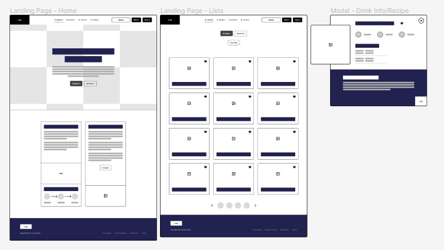
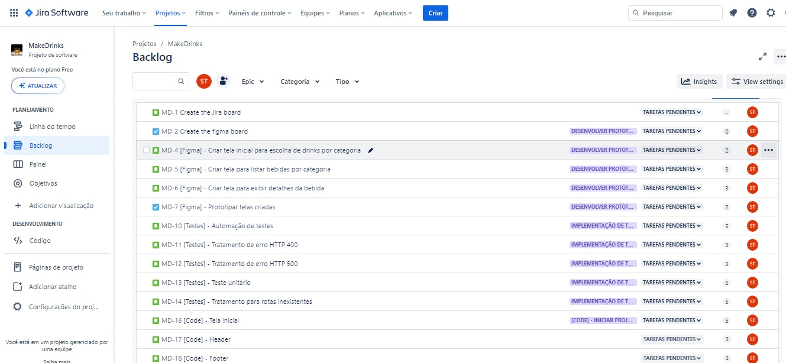

# Make Drinks - Frontend Junior Project

Bem-vindo ao Make Drinks! Este é um projeto para o desafio técnico para a posição de Frontend Júnior da empresa [Faster](https://www.fstr.co/).
O Make drinks é um aplicativo web que utiliza a API [TheCocktailDB](https://www.thecocktaildb.com/) para fornecer informações sobre diversos drinks. A documentação abaixo fornece detalhes sobre a estrutura, funcionalidades e utilização do projeto.

## Conteúdo

1. [Estrutura do Projeto](#estrutura-do-projeto)
2. [Funcionalidades](#funcionalidades)
3. [Como Utilizar](#como-utilizar)
   - [Setup do projeto](#setup-do-projeto)
   - [Página de Drinks](#página-de-drinks)
4. [Footer e Redes Sociais](#footer-e-redes-sociais)
5. [Design e Prototipagem](#design-e-prototipagem)
    - [Wireframes](#wireframes)
    - [Design System Manager](#design-system-manager)
6. [Organização do projeto](#organização-do-projeto)
    - [Jira](#jira)

## Estrutura do Projeto

O projeto é estruturado da seguinte forma:

```
make-drinks/
|-- index.html
|-- assets/
|   |-- drink1.png
|   |-- Email.png
|   |-- Github.png
|   |-- imgCoffeeDrink.png
|   |-- imgDrinkCup.png
|   |-- imgFavoriteDrink.png
|   |-- imgHandSelect.png
|   |-- Linkedin.png
|   |-- logo.png
|   |-- MD.png
|   |-- Twitter.png
|   |-- Whatsapp.png
|-- components/
|   |-- icons/
|       |-- email.vue
|       |-- emptyfavorite.vue
|       |-- emptyfavoritered.vue
|       |-- facebook.vue
|       |-- github.vue
|       |-- linkedin.vue
|       |-- menuBars.vue
|       |-- search.vue
|       |-- twitter.vue
|       |-- user.vue
|       |-- whatsapp.vue
|   |-- CardsComponent.vue/
|   |-- CarouselInitialPage.vue/
|   |-- CategoryButton.vue/
|   |-- CategoryDrinks.vue/
|   |-- DrinkModal.vue/
|   |-- Footer.vue/
|   |-- Header.vue/
|-- layouts/
|   |-- default.vue/
|-- node_modules/
|-- pages/
|   |-- FavoriteDrinks.vue
|   |-- index.vue
|-- public/
|   |-- favicon.ico
|   |-- images_readme/
|       |-- imgDesignSystemManager.jpg
|       |-- imgJira.jpg
|       |-- imgWireframes.jpg
|-- server/
|   |-- tsconfig.json
|-- .gitignore/
|-- app.vue/
|-- nuxt.config.ts/
|-- package-lock.json/
|-- package.json/
|-- README.md
|-- tsconfig.json/
```

## Funcionalidades

- **Header na Página Inicial:**
  - Menu sanduíche.
  - Botão de perfil do usuário com visualização de drinks favoritos.
  - Botão de pesquisa por nome de drink.
  - Logo redirecionando para a página inicial.

- **Página Inicial:**
  - Botão para selecionar categoria da bebida.
  - Espaço para "Nossa história" e logo do aplicativo (Make Drinks).
  - Descrição de como utilizar o site com 3 ícones instrutivos.
  - Footer com breve descrição e ícones para redes sociais.

- **Página de Drinks:**
  - Cards com imagem, botão de coração para favoritar e nome do drink.
  - Modal ao clicar em um card com detalhes do drink.
  - Informações no modal: imagem, nome, alcoólico ou não, tipo de copo, ingredientes com medidas e instrução de preparo.
  - Opção de favoritar/desfavoritar com armazenamento em localStorage.

## Como Utilizar

### Setup do projeto

1. Clone o repositório: `git clone https://github.com/sammytrindade/NewMakeDrinks`
2. Instale as dependências com: `npm install`
3. Abra o projeto e rode: `npm run dev`.
4. Você deverá acessar o servidor: `http://localhost:3000`

### Página de Drinks

- Navegue pelos cards na página inicial.
- Clique em um card para abrir um modal com detalhes do drink.
- No modal, favoritar/desfavoritar o drink.
- Limpe a lista de favoritos pelo "Inspecionar" no navegador, vá para "Application", acesse "Local Storage" e clique com o botão direito para limpar o histórico.

## Footer e Redes Sociais

O footer contém uma breve descrição do projeto e ícones para redes sociais da desenvolvedora (E-mail, Github, Linkedin, Twitter, Whatsapp).

## Design e Prototipagem

O design do projeto foi elaborado usando o Figma. Você pode visualizar o protótipo [aqui](https://www.figma.com/proto/63QdOBwXAqPU31NeqkYZTw/Make-drinks?type=design&node-id=324-17789&t=cKR7EMjwP7ZBjJja-1&scaling=scale-down&page-id=324%3A17736&starting-point-node-id=324%3A17789&mode=design).

Obs: Inicialmente houve um equívoco no entendimento do desafio proposto. Ao acessar o site: [The Cocktail DB](https://www.thecocktaildb.com/api.php), visualizei o `Filter by Category` e havia entendido que só existiam duas categorias, então todo o projeto inicialmente foi pensado dessa forma. 
Futuramente irei refatorar o design para o combobox atual com as diversas opções de categorias.

### Wireframes



### Design System Manager


## Organização do projeto

### Jira

- Este projeto segue uma metodologia de desenvolvimento organizada e eficiente (Scrum), utilizando o Jira para o gerenciamento de tarefas.
Cada funcionalidade, correção ou melhoria é representada por um card no Jira, proporcionando uma visão clara do progresso do projeto.




Aproveite o Make Drinks! 🍹🍸🥂
